<h1 align="center">🔳 RISC-V SoC Tapeout Program — Week 3ï¸âƒ£</h1>

<p align="center">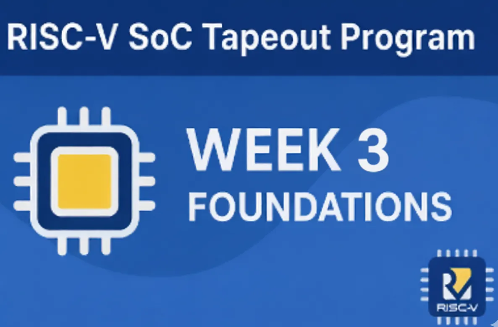</p>

---

<div align="center">

# 🚀 Week 3 —  Post Synthesis GLS & STA Fundamentals

🌟 

</div>

---

<details>
<summary><h2> 🌟 TASK1-Post Synthesis GLS </h2> </summary>


# 🧠 Week 3 – Post-Synthesis Simulation of VSDBabySoC (GLS)

After completing RTL-level verification in Week 2, the next milestone is to **verify the functionality of the synthesized (gate-level) design**.

👉Post-synthesis simulation (also called **Gate-Level Simulation – GLS**) is one of the **most important steps** in the ASIC design flow. After synthesis, our BabySoC RTL is converted into a **gate-level netlist** using the Sky130 standard cell library. The goal here is simple:

👉 To ensure that the design **still works exactly as intended** after synthesis, and to check if there are **any timing-related issues** that were not visible in pre-synthesis simulation.

---

## 🔨 Purpose of Gate-Level Simulation (GLS)

The **main objectives** of GLS for BabySoC are:

1. **Functionality + Timing Verification**
    - Checks whether the **gate-level netlist** still behaves as the RTL design.
    - Uses **SDF (Standard Delay Format)** for accurate timing verification.
2. **Dynamic Circuit Behavior**
    - Captures real-world issues like **glitches** or **metastability** which are invisible in RTL.
3. **Post-Synthesis Validation**
    - Confirms that modules like the **RISC-V core, PLL, and DAC** are all mapped correctly to standard cells.
    - Ensures there are **no unexpected latches, mismatches, or synthesis-induced bugs**.
4. **Final Check Before PnR**
    - This is the **last chance** to catch functional/timing problems **before moving to Physical Design (PnR)**.

<p align="center">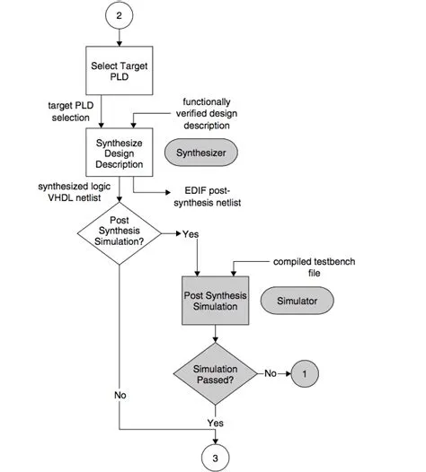</p>

---

## 🯠Objective

1. Perform **logic synthesis** on the BabySoC design using Yosys.
2. Generate a **gate-level netlist** that represents the same behavior as the RTL.
3. Run a **post-synthesis simulation** using Icarus Verilog.
4. Compare **pre- and post-synthesis** simulation waveforms to confirm functional equivalence.

---

## âš™ï¸Step 1 –Environment Setup

Before moving into synthesis, verify that your environment is ready:

```bash
sudo apt update
sudo apt install yosys iverilog gtkwave
```

🧩 **Tools we’ll use:**

- **Yosys** – Open-source synthesis tool
- **Icarus Verilog** – Simulator for gate-level testing
- **GTKWave** – Waveform viewer

---

## 🗂ï¸Step 2 –Organizing Directories

To keep the workflow structured, create dedicated folders inside the `output/` directory.

```bash
mkdir -p output/synth output/post_synth_sim
```

Your updated directory tree should now look like this 👇

```bash
output/
├── pre_synth_sim/
│   ├── pre_synth_sim.out
│   ├── vsdbabysoc.synth.v
│   └── pre_synth_sim.vcd
└── post_synth_sim/
```

This separation makes debugging and file tracking much easier.

---

## 🧰 Step 3 –Synthesis with Yosys

- The synthesis process converts RTL code into →  equivalent gate-level representation (netlist).

### 1ï¸âƒ£ Launch Yosys

```bash
yosys
```

<p align="center">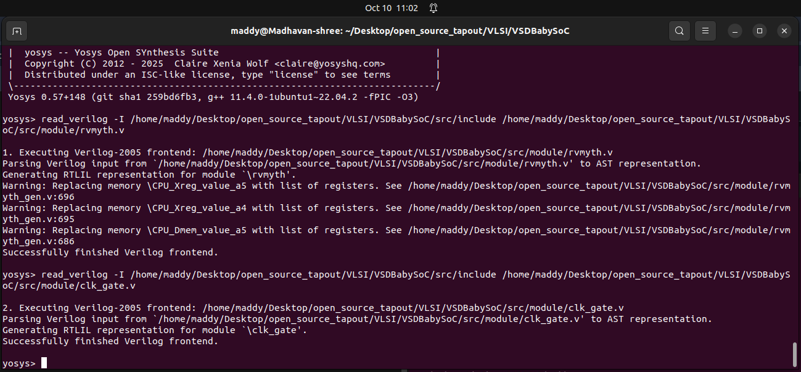</p>

---

### 2ï¸âƒ£ Read all verilog files

```bash
```
### Load RTL files
yosys> read_verilog src/module/vsdbabysoc.v
yosys> read_verilog -I src/include src/module/rvmyth.v
yosys> read_verilog -I src/include src/module/clk_gate.v
```


---

### **3ï¸âƒ£ Load the Liberty Files for Synthesis**

```bash
# Load library files
yosys> read_liberty -lib src/lib/avsdpll.lib
yosys> read_liberty -lib src/lib/avsddac.lib
yosys> read_liberty -lib src/lib/sky130_fd_sc_hd__tt_025C_1v80.lib
```

<p align="center"></p>

---

### **4ï¸âƒ£ Run Synthesis Targeting `vsdbabysoc`**

```bash
yosys> synth -top vsdbabysoc
```

<p align="center"></p>

---

### 5ï¸âƒ£Statistics of Yosys Synthesis

<p align="center">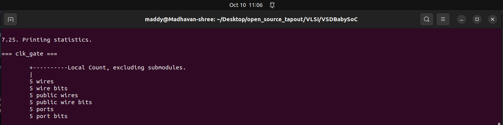</p>

<p align="center"></p>

<p align="center"></p>

<p align="center"></p>

<p align="center"></p>

---

### **6ï¸âƒ£ Map D Flip-Flops to Standard Cells**

```bash
yosys> dfflibmap -liberty src/lib/sky130_fd_sc_hd__tt_025C_1v80.lib
```

<p align="center"></p>

---

### **7ï¸âƒ£ Perform Optimization and Technology Mapping**

```bash
yosys> opt
yosys> abc -liberty src/lib/sky130_fd_sc_hd__tt_025C_1v80.lib -script +strash;scorr;ifraig;retime;{D};strash;dch,-f;map,-M,1,{D}
```

<p align="center">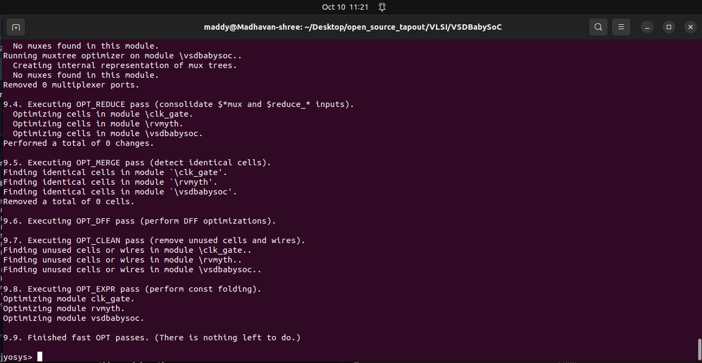</p>

<p align="center"></p>

---

### **8ï¸âƒ£ Perform Final Clean-Up and Renaming**

```bash
yosys> flatten
yosys> setundef -zero
yosys> clean -purge
yosys> rename -enumerate
```

<p align="center"></p>

---

### **9ï¸âƒ£ Check Statistics**

```bash
yosys> stat
```

<p align="center">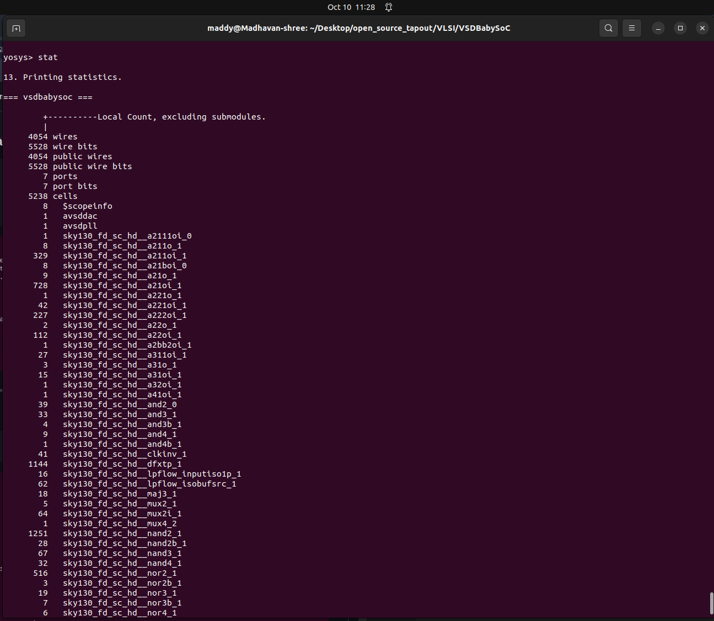</p>

---

### **🔟 Write the Synthesized Netlist**

```bash
yosys> write_verilog -noattr output/post_synth_sim/vsdbabysoc.synth.v
```

<p align="center"></p>

✅ **Output:** `synth_netlist.v` – the synthesized gate-level version of our BabySoC core.

```bash
yosys> cd output/post_synth_sim/
```

<p align="center">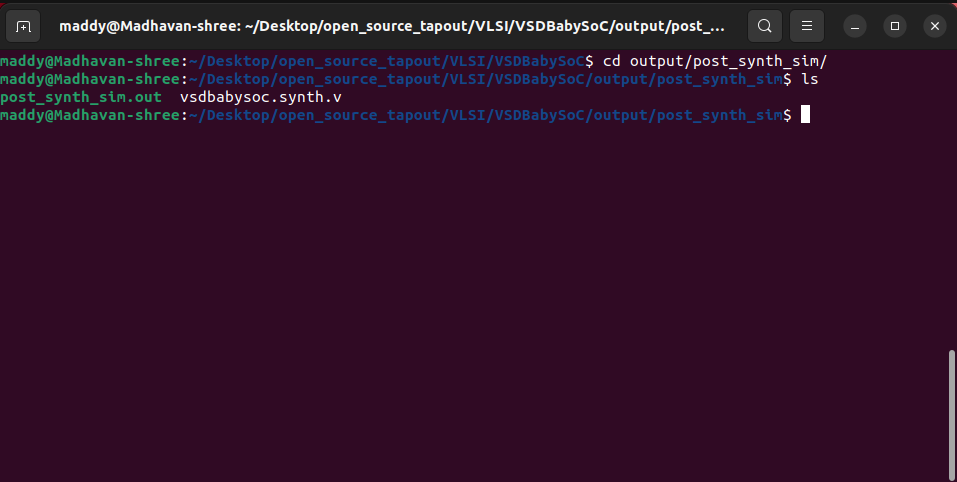</p>

---

## 🧪 Step 4 – Post-Synthesis Simulation

📌 Before going to next check your directory, that should now look like this 👇

```bash
output/
├── pre_synth_sim/
│   ├── pre_synth_sim.out
│   ├── vsdbabysoc.synth.v
│   └── pre_synth_sim.vcd
├── post_synth_sim/
    ├── vsdbabysoc.synth.v
    └── post_synth_sim.out
```

Now that we have the gate-level netlist, we must verify that its behavior matches the RTL simulation results.

We use the **same testbench** (`tb_mythcore_test.v`), replacing the RTL design with the synthesized netlist.

### 🔹 Compile the Gate-Level Design

```bash
iverilog -o /home/maddy/Desktop/open_source_tapout/VLSI/VSDBabySoC/output/post_synth_sim/post_synth_sim.out -DPOST_SYNTH_SIM -DFUNCTIONAL -DUNIT_DELAY=#1 -I /home/maddy/Desktop/open_source_tapout/VLSI/VSDBabySoC/src/include -I /home/maddy/Desktop/open_source_tapout/VLSI/VSDBabySoC/src/module /home/maddy/Desktop/open_source_tapout/VLSI/VSDBabySoC/src/module/testbench.v
```
### 🔹 Post-Synthesis Simulation – Command Breakdown

```bash
iverilog \
  -o output/post_synth_sim/post_synth_sim.out \   # Output simulation executable
  -DPOST_SYNTH_SIM \                              # Enable POST_SYNTH_SIM mode
  -DFUNCTIONAL \                                  # Use behavioral models
  -DUNIT_DELAY=#1 \                               # Assign #1 delay for all gates
  -I src/include \                                # Include path for header files
  -I src/module \                                 # Include path for modules
  src/module/testbench.v                          # Top-level testbench

```

**Explanation of Options:**

- 🔹 **`iverilog`** → Icarus Verilog compiler to convert Verilog into an executable.
- 🔹 **`o <path>`** → Output binary path for the simulation.
- 🔹 **`DPOST_SYNTH_SIM`** → Switch testbench to post-synthesis simulation mode.
- 🔹 **`DFUNCTIONAL`** → Use high-level behavioral models instead of gate timing.
- 🔹 **`DUNIT_DELAY=#1`** → Assigns a unit delay of `#1` for all gates.
- 🔹 **`I <include_path>`** → Add include directories for modules or headers.
- 🔹 **`testbench.v`** → Specifies the testbench as the top-level simulation file.

### 🔹 Run the Simulation

```bash
cd output/post_synth_sim
./post_synth_sim.out
```

This will produce a new `.vcd` file (waveform dump).

<p align="center">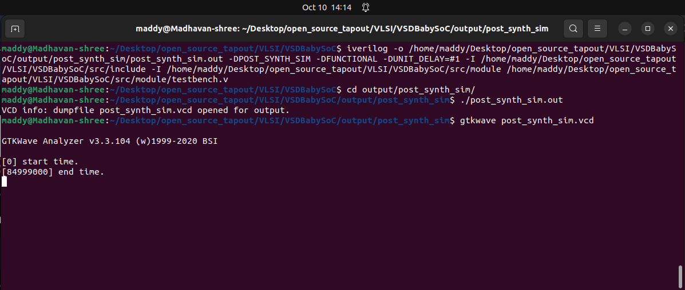</p>

### 🔹 Visualize the Waveform by GTKwave

```bash
gtkwave tb_mythcore_test_post.vcd
```

Observe signal transitions, clock gating, and output behavior.

<p align="center">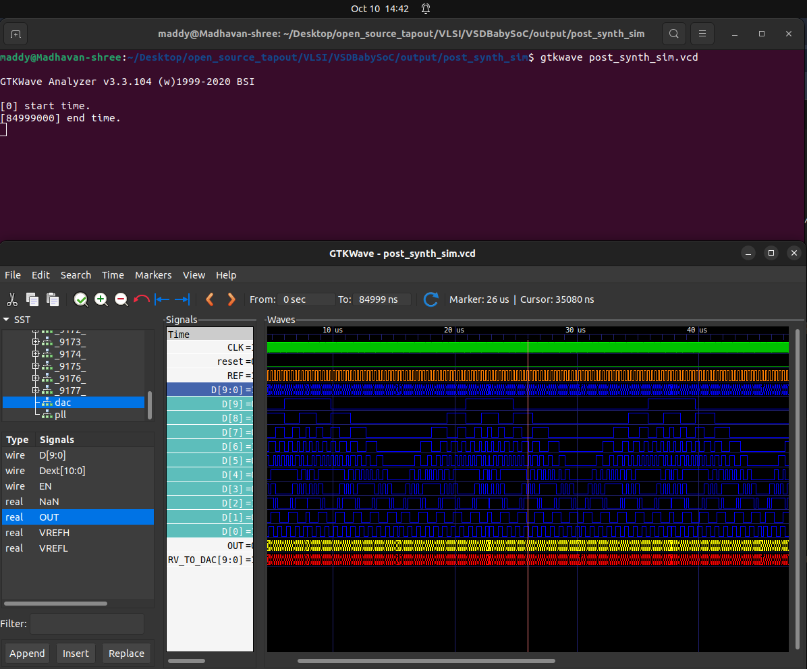</p>

---

## 🔬 Step 5 – Result Analysis

When you compare **pre- and post-synthesis waveforms** in GTKWave (`pre_synth_sim.vcd` vs `post_synth_sim.vcd`):

- The **functional behavior** should be identical.
- Slight **timing variations** may appear because the synthesized design includes gate delays.
- Successful matching confirms that **Yosys synthesis preserved the RTL logic**.

---

## 🧩 Step 6 – Conclusion

🉠**Post-synthesis verification completed!**

| Stage | Tool | Output | Verification |
| --- | --- | --- | --- |
| RTL Simulation | Icarus Verilog | `pre_synth_sim.vcd` | Functional correctness |
| Synthesis | Yosys | `vsdbabysoc.synth.v.v` | Logical equivalence |
| Gate-Level Simulation | Icarus Verilog | `post_synth_sim.vcd` |  |

---

## **Comparing Pre-Synthesis âš¡VSâš¡ Post-Synthesis Output**

Why because the matching outputs between pre- and post-synthesis simulations mean the synthesis process has preserved your design’s functionality, while now adding real-world timing considerations. 

### 🔹 Pre-Synthesis **⚡** Post-Synthesis

| Aspect | Pre-Synthesis | Post-Synthesis |
| --- | --- | --- |
| **Purpose** | Verify RTL logic & functionality | Verify gate-level design & timing |
| **Focus** | Logical correctness, design intent | Gate delays, timing violations, glitches |
| **Simulation** | Behavioral, fast | Gate-level, includes timing info |
| **Outcome** | Confirms RTL works as intended | Confirms synthesized design behaves correctly in real-world conditions |

📌  Pre-Synthesis output

<p align="center"></p>

📌 Post-Synthesis output

<p align="center">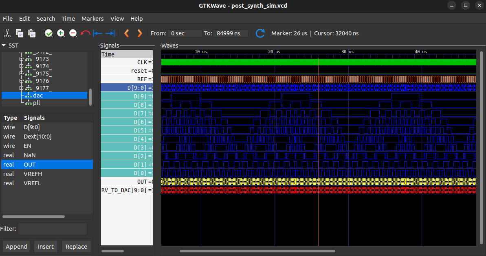</p>

</details>


<details>
<summary><h2> 🌟 TASK2-Fundamentals of STA (Static Timing Analysis) </h2> </summary>

## **â±ï¸ Introduction**

**Static Timing Analysis (STA)** is one of the many techniques available to verify the timing of a digital design.

An alternate approach used to verify timing is **timing simulation**, which checks both functionality and timing behavior.

The term *timing analysis* refers to either of these two methods — static timing analysis or timing simulation.

STA is *static* because it analyzes the circuit without applying input vectors. In contrast, simulation-based timing analysis applies stimuli to the circuit inputs, observes behavior, and checks timing dynamically.

In a CMOS digital design flow, STA can be performed at multiple implementation stages.

<p align="center">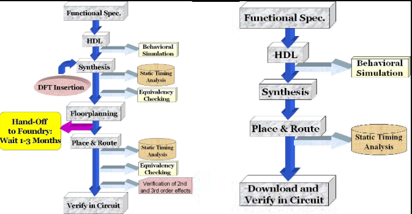</p>

---

## **âš™ï¸ OpenSTA Overview**

**OpenSTA** is an open-source static timing analysis tool used to analyze and verify timing performance of digital circuits at the gate level.

It uses a **TCL command interpreter** to read design files, specify constraints, and generate timing reports.

---

## **ğŸ“Input Files**

- `.v` — Gate-level Verilog Netlist
- `.lib` — Liberty Timing Libraries
- `.sdc` — Synopsys Design Constraints (clocks, delays, false paths)
- `.sdf` — Annotated Delay File (optional)
- `.spef` — Parasitics (RC extraction)
- `.vcd` / `.saif` — Switching activity for power analysis

---

## **â°Clock Modeling Features**

- **Generated Clocks:** Derived from existing clocks
- **Latency:** Clock propagation delay
- **Source Latency:** Delay from clock source to input
- **Uncertainty:** Accounts for jitter or skew
- **Propagated vs. Ideal:** Real vs. ideal clock network modeling
- **Gated Clock Checks:** For conditionally enabled clocks
- **Multi-Frequency Clocks:** Multi-domain clock analysis

---

## **🚧Exception Paths**

Timing exceptions refine analysis for realistic circuit behavior:

- `set_false_path` — Ignores invalid paths
- `set_multicycle_path` — Allows multi-cycle operations
- `set_max_delay` / `set_min_delay` — Defines custom timing limits
    
<p align="center">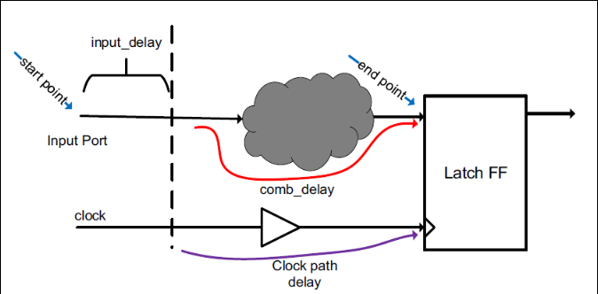</p>
    

---

## **âš¡Delay Calculation**

- **Integrated Dartu/Menezes/Pileggi Algorithm:**
    
    Computes effective capacitance for RC networks to model realistic gate/net delays.
    
- **External Delay Calculator API:**
    
    Enables custom delay modeling (layout-aware or temperature-adaptive).
    

---

## **📊Timing Analysis & Reporting**

OpenSTA offers commands for analyzing paths, delays, and setup/hold checks.

Example:

```
report_checks -from [get_pins U1/Q] -to [get_pins U2/D]

```

---

## **Timing Paths**

**Definition:**

Timing paths represent the logical signal routes between source and destination, including combinational and sequential elements.

STA analyzes timing paths to evaluate delays, setup, and hold requirements.

### **Timing Path Elements**

- **Start Point:**
    
    The origin of the signal — usually an input port or clock pin of a register.
    
- **End Point:**
    
    The destination — either a register input (D pin) or an output port.
    
- **Combinational Logic:**
    
    Logic between start and end points that determines signal delay.
    

**Path Types:**

1. Input → Register (in2reg)
2. Register → Register (reg2reg)
3. Register → Output (reg2out)
4. Input → Output (in2out)
    
<p align="center">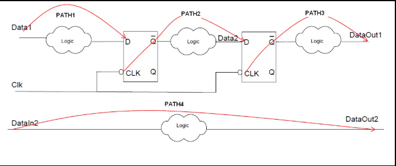</p>
    

---

## **Setup and Hold Checks**

- **Setup Check:**
    
    Minimum time data must be stable *before* the clock edge.
    
    Violations can cause incorrect data capture.
    
- **Hold Check:**
    
    Minimum time data must remain stable *after* the clock edge.
    
    Violations can cause metastability or data corruption.
    
<p align="center">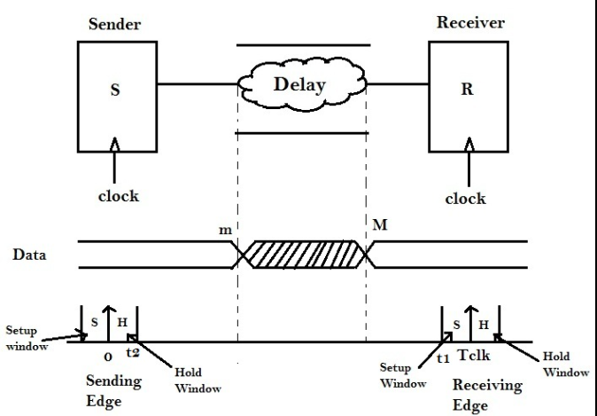</p>
    

---

## **ğŸ“Slack Calculation**

Slack measures how close a design is to meeting timing requirements.

- **Setup Slack:**
    
    `Setup slack = Data required time - Data arrival time`
    
- **Hold Slack:**
    
    `Hold slack = Data arrival time - Data required time`
    

**Interpretation:**

- Positive slack → Design meets timing.
- Zero slack → Critical timing condition.
- Negative slack → Timing violation.
    
<p align="center">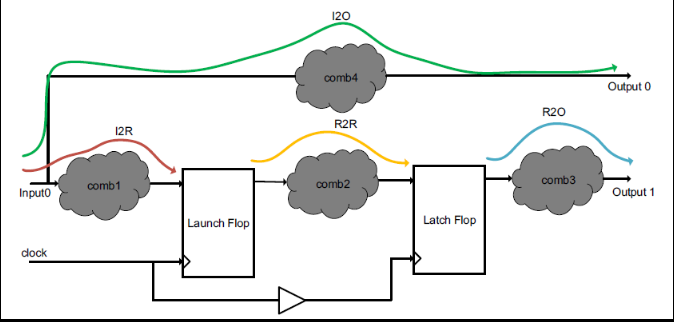</p>
    

---

## **📠Common SDC Constraints**

**Synopsys Design Constraints (SDC)** define timing, environment, and design behavior.

### **Categories**

| ğŸ·ï¸ **Category** | âš™ï¸ **Commands** |
| --- | --- |
| **Operating Conditions** | `set_operating_conditions` |
| **Wire-Load Models** | `set_wire_load_mode`, `set_wire_load_model`, `set_wire_load_selection_group` |
| **Environmental** | `set_drive`, `set_driving_cell`, `set_load`, `set_fanout_load`, `set_input_transition`, `set_port_fanout_number` |
| **Design Rules** | `set_max_capacitance`, `set_max_fanout`, `set_max_transition` |
| **Timing** | `create_clock`, `create_generated_clock`, `set_clock_latency`, `set_clock_transition`, `set_disable_timing`, `set_propagated_clock`, `set_clock_uncertainty`, `set_input_delay`, `set_output_delay` |
| **Exceptions** | `set_false_path`, `set_max_delay`, `set_multicycle_path` |
| **Power** | `set_max_dynamic_power`, `set_max_leakage_power` |

</details>


<details>
<summary><h2> 🌟 TASK3-Generate Timing Graphs with OpenSTA</h2> </summary>


## 🗂ï¸Organizing Directories

To keep the workflow structured, create dedicated folders inside the `OpenSTA/` directory.

```bash
cd VSDBabgySoC

mkdir OpenSTA

cd OpenSTA
```

My updated directory tree should now look like this 👇

```bash
VSDBabySoC/
├── src/
├── output/
└── OpenSTA/

```

This separation makes debugging and file tracking much easier.

<p align="center"></p>

---

## **Installation of OpenSTA**

**Note:** Installation instructions are adapted from the official OpenSTA repository: 🔗 [https://github.com/parallaxsw/OpenSTA](https://github.com/parallaxsw/OpenSTA)

**Step 1: Clone the Repository**

```
git clone https://github.com/parallaxsw/OpenSTA.git
cd OpenSTA
```

<p align="center"></p>

**Step 2: Build the Docker Image**

```
docker build --file Dockerfile.ubuntu22.04 --tag opensta .
```

This builds a Docker image named opensta using the provided Ubuntu 22.04 Dockerfile. All dependencies are installed during this step.

<p align="center"></p>

<p align="center">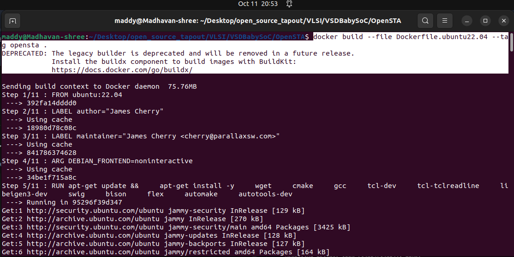</p>

<p align="center">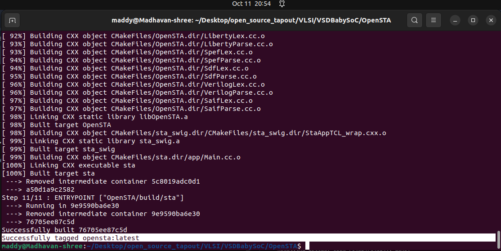</p>

**Step 3: Run the OpenSTA Container**

To run a docker container using the OpenSTA image, use the -v option to docker to mount direcories with data to use and -i to run interactively.

```
docker run -i -v $HOME:/data opensta
```

<p align="center">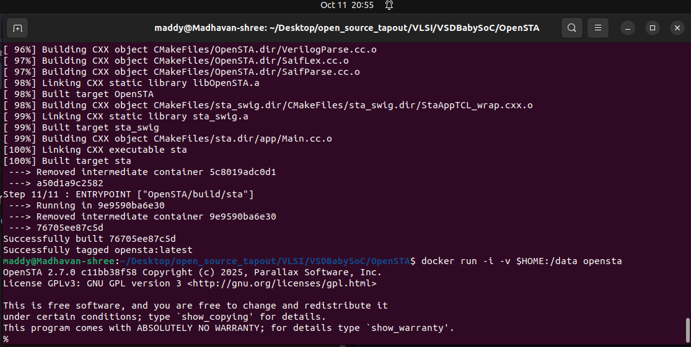</p>

You now have OpenSTA installed and running inside a Docker container. After successful installation, you will see the % prompt—this indicates that the OpenSTA interactive shell is ready for use.

**Timing Analysis Using Inline Commands**

Once inside the OpenSTA shell (% prompt), you can perform a basic static timing analysis using the following inline commands:

```
# Instructs OpenSTA to read and load the Liberty file "nangate45_slow.lib.gz".
read_liberty /OpenSTA/examples/nangate45_slow.lib.gz

# Intructs OpenSTA to read and load the Verilog file (gate level verilog netlist) "example1.v"
read_verilog /OpenSTA/examples/example1.v

# Using "top," which stands for the main module, links the Verilog code with the Liberty timing cells.
link_design top

# Create a 10ns clock named 'clk' for clk1, clk2, and clk3 inputs
create_clock -name clk -period 10 {clk1 clk2 clk3}

# Set 0ns input delay for inputs in1 and in2 relative to clock 'clk'
set_input_delay -clock clk 0 {in1 in2}

# Report of the timing checks for the design
report_checks
```

*This flow is useful for quick testing and debugging without writing a full TCL script.*

<p align="center">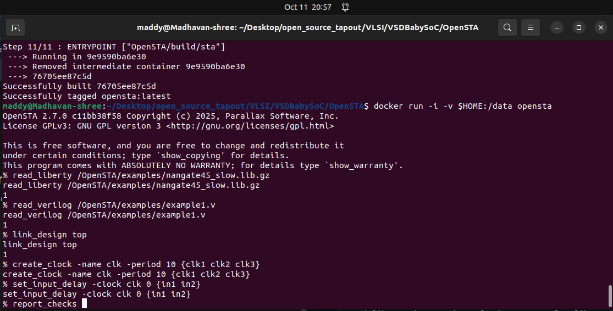</p>

**Note:** We used report_checks here because only the slow liberty file (nangate45_slow.lib.gz) is loaded.

<p align="center">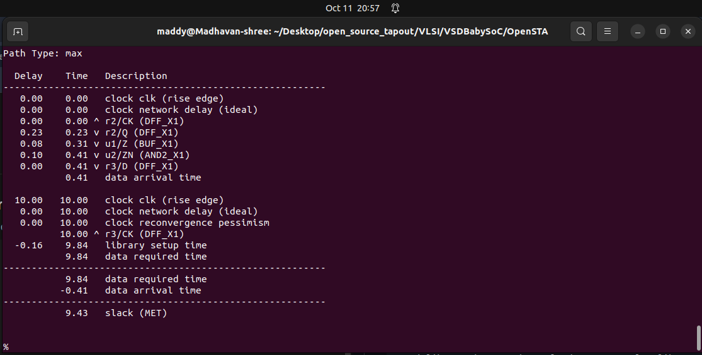</p>

<p align="center"></p>

<p align="center">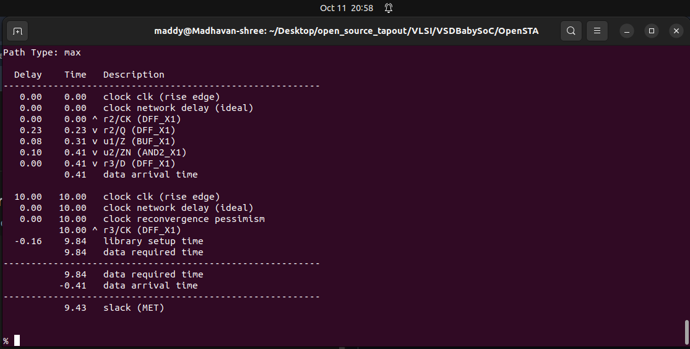</p>

<p align="center">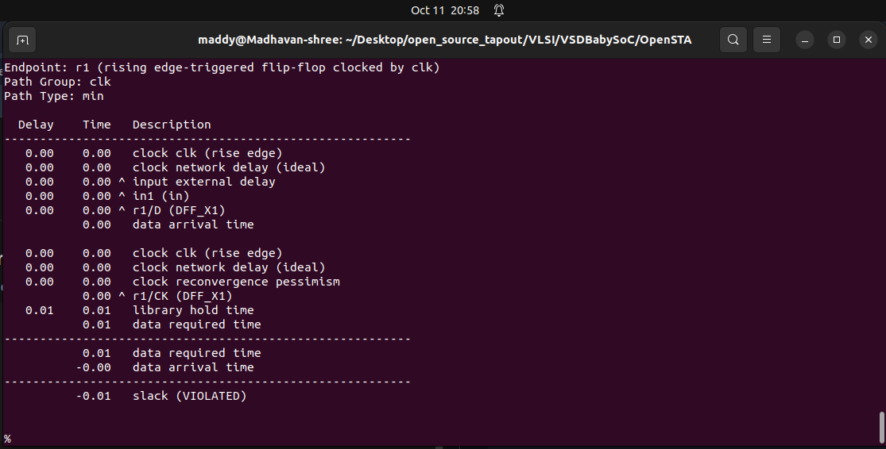</p>

This represents a setup (max delay) corner, so the analysis focuses on setup timing by default.

---

**Why Does report_checks Show Only Max (Setup) Paths?**

By default, report_checks reports -path_delay max (i.e., setup checks).

OpenSTA interprets report_checks without arguments as:

```
report_checks -path_delay max
```

<p align="center">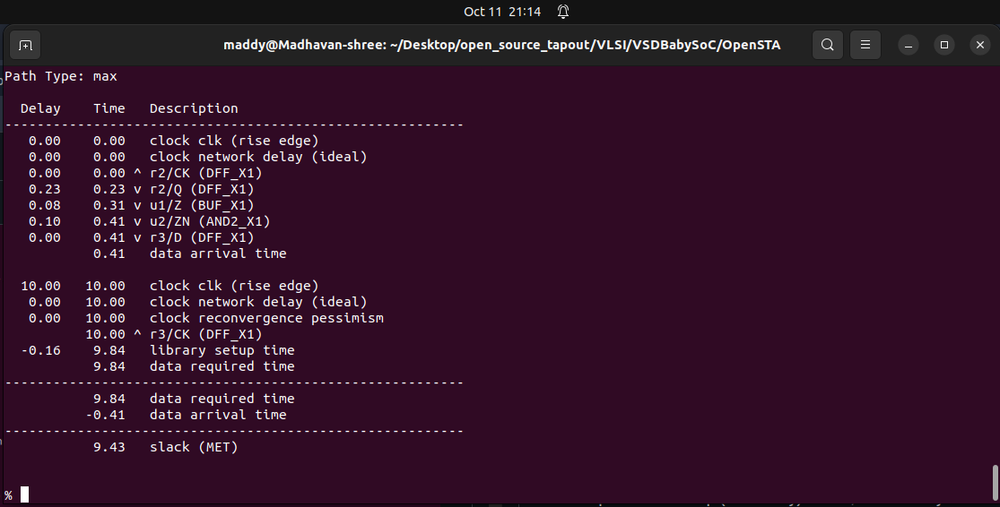</p>

This reports only max path delays, i.e., setup timing checks.

✅**How to Also Get Hold (min) Paths:**

If you want both setup and hold timing checks (i.e., both max and min path delays), use:

```
report_checks -path_delay min
```

<p align="center">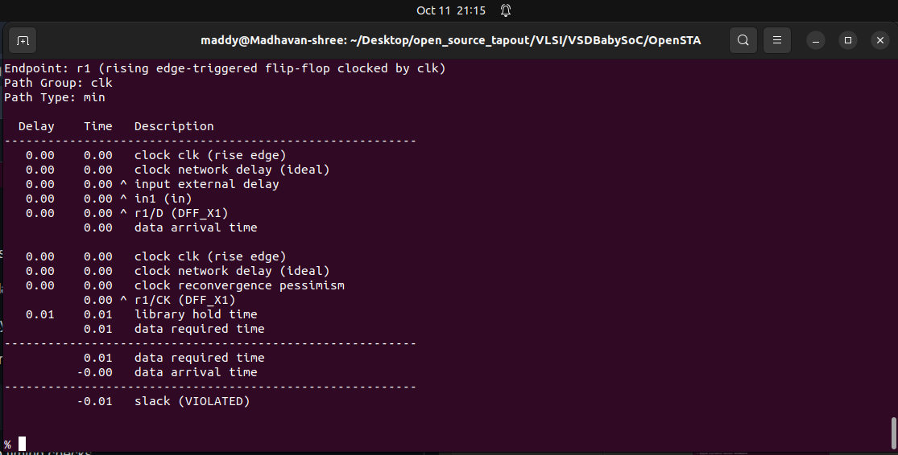</p>

**Analyzing report outcomes**

*Verilog Netlist: example1.v*

```
module top (in1, in2, clk1, clk2, clk3, out);
  input in1, in2, clk1, clk2, clk3;
  output out;
  wire r1q, r2q, u1z, u2z;

  DFF_X1 r1 (.D(in1), .CK(clk1), .Q(r1q));
  DFF_X1 r2 (.D(in2), .CK(clk2), .Q(r2q));
  BUF_X1 u1 (.A(r2q), .Z(u1z));
  AND2_X1 u2 (.A1(r1q), .A2(u1z), .ZN(u2z));
  DFF_X1 r3 (.D(u2z), .CK(clk3), .Q(out));
endmodule
```

Here are the commands for Yosys synthesis for example1.v:

```bash
cd VSDBabySoC/OpenSTA/examples/
VSDBabySoC/OpenSTA/examples$ yosys
yosys> read_liberty -lib nangate45_slow.lib
```

- you will possible face this error like this

<p align="center"></p>

- because the files are in ```gz```

<p align="center">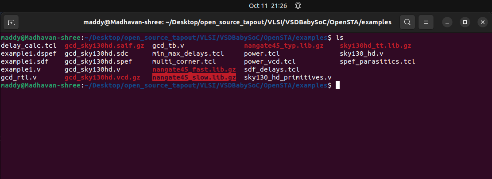</p>

- follow the commands

```bash
gunzip nangate45_slow.lib.gz
```

<p align="center">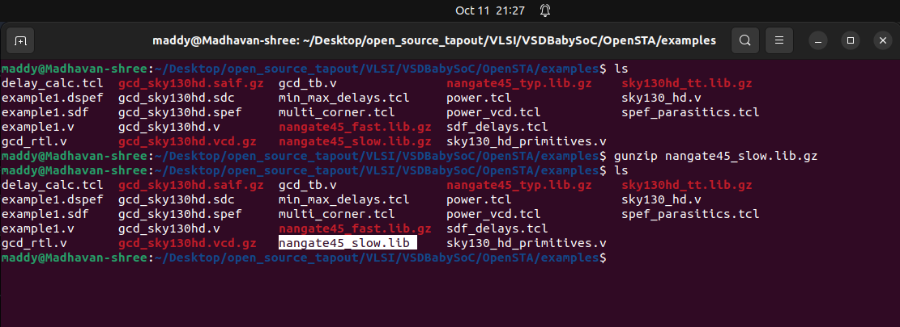</p>

---

```bash
patha@spatha-VirtualBox:~/VLSI/VSDBabySoC/OpenSTA/examples$ yosys
yosys> read_liberty -lib nangate45_slow.lib
yosys> read_verilog example1.v
yosys> synth -top top
```

<p align="center">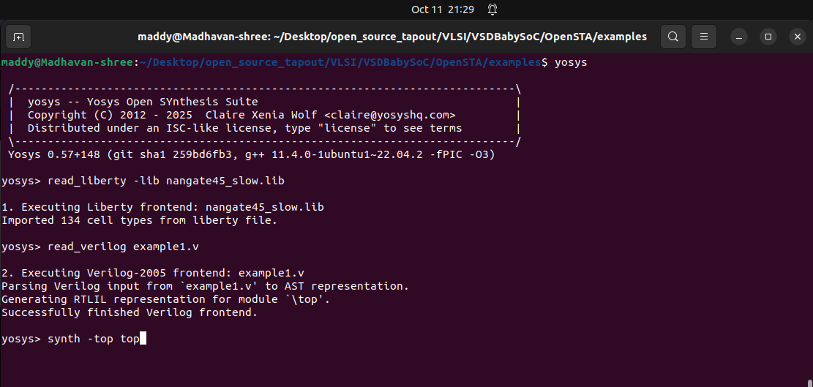</p>

<p align="center">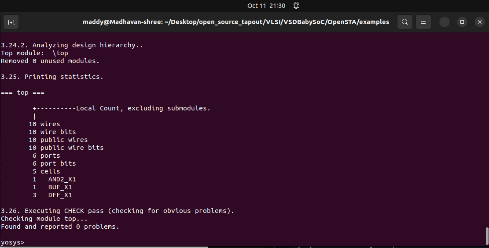</p>

```bash
yosys> show
```

<p align="center">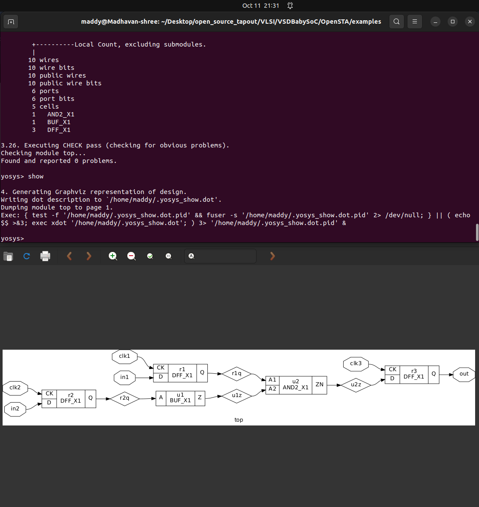</p>

---

## **Static timing analysis using OpenSTA**

### **Timing Ananlysis Using In line Commands**

Here’s the same OpenSTA timing analysis flow with added SPEF-based parasitic modeling:

This enables **more realistic delay and slack computation** by including post-layout RC data, improving timing signoff precision.

```
docker run -i -v $HOME:/data opensta
```

```bash
read_liberty /OpenSTA/examples/nangate45_slow.lib.gz
read_verilog /OpenSTA/examples/example1.v
link_design top
read_spef /OpenSTA/examples/example1.dspef
create_clock -name clk -period 10 {clk1 clk2 clk3}
set_input_delay -clock clk 0 {in1 in2}
report_checks
```

<p align="center">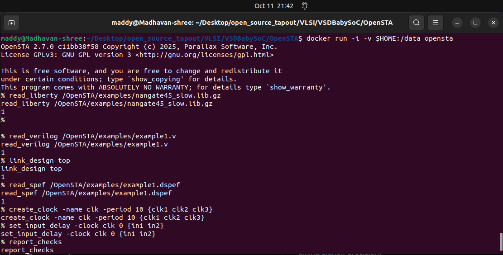</p>

<p align="center">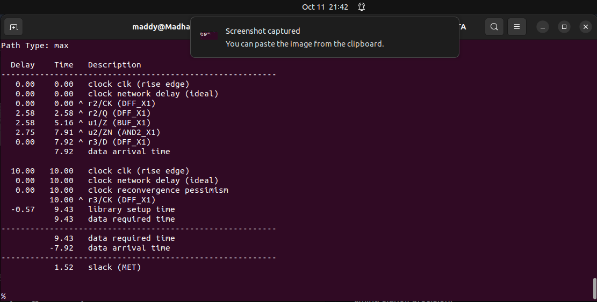</p>

---

**Report Capacitance per Stage**

Reports timing paths with 4-digit precision and shows the net capacitance at each stage, helping identify high-cap nodes that may affect delay.

---

**Report Timing with Capacitance, Slew, Input Pins, and Fanout**

Report timing with capacitance, slew, input pins, and fanout per stage.

<p align="center">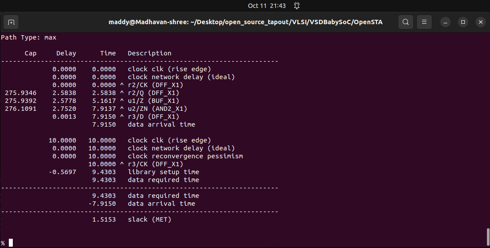</p>

<p align="center">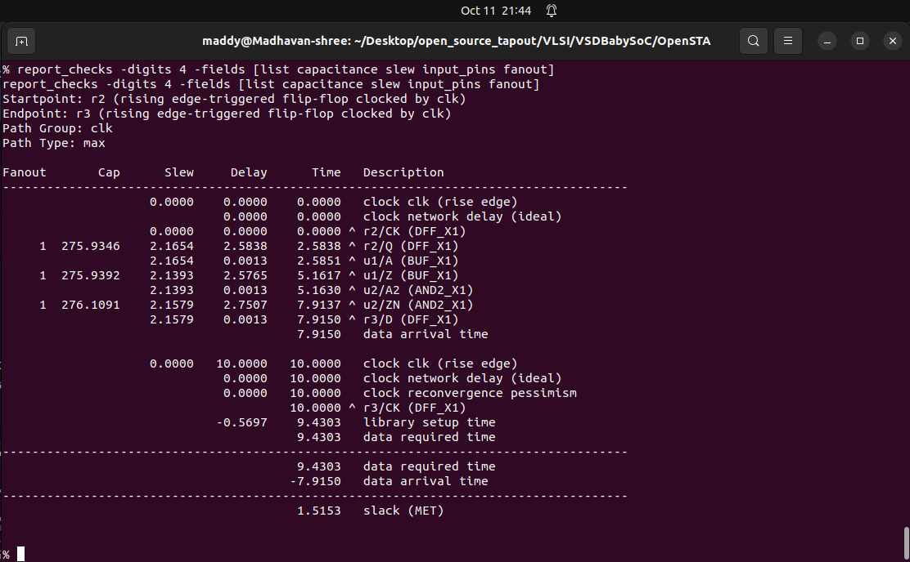</p>

---

**Timing Analysis Using a TCL Script**

To automate the timing flow, you can write the commands into a .tcl script and execute it from the OpenSTA shell.

cmds

```
# Load liberty files for max and min analysis
read_liberty -max /home/maddy/Desktop/open_source_tapout/VLSI/VSDBabySoC/OpenSTA/examples/nangate45_slow.lib
read_liberty -min /home/maddy/Desktop/open_source_tapout/VLSI/VSDBabySoC/OpenSTA/examples/nangate45_fast.lib

# Read the gate-level Verilog netlist
read_verilog /home/maddy/Desktop/open_source_tapout/VLSI/VSDBabySoC/OpenSTA/examples/example1.v

# Link the top-level design
link_design top

# Define clocks and input delays
create_clock -name clk -period 10 {clk1 clk2 clk3}
set_input_delay -clock clk 0 {in1 in2}

# Generate a full min/max timing report
report_checks -path_delay min_max
```

| **Line of Code** | **Purpose** | **Explanation** |
| --- | --- | --- |
| `read_liberty -max nangate45_slow.lib.gz` | Load max delay library | Loads the **slow corner Liberty file** for **setup (max delay)** analysis. |
| `read_liberty -min nangate45_fast.lib.gz` | Load min delay library | Loads the **fast corner Liberty file** for **hold (min delay)** analysis. |
| `read_verilog example1.v` | Load gate-level netlist | Reads the synthesized **Verilog netlist** of the design. |
| `link_design top` | Link design | Links the netlist using `top` as the **top-level module**, connecting it with Liberty cells. |
| `create_clock -name clk -period 10 {clk1 clk2 clk3}` | Create clock | Defines a **clock named `clk`** with a 10 ns period on ports `clk1`, `clk2`, and `clk3`. |
| `set_input_delay -clock clk 0 {in1 in2}` | Set input delay | Applies **0 ns input delay** relative to `clk` for inputs `in1` and `in2`. |
| `report_checks -path_delay min_max` | Run full STA | Reports both **setup (max)** and **hold (min)** timing paths and checks. |

---

**Run the Script Using Docker**

To run this script non-interactively using Docker:

```bash
docker run -it -v $HOME:/data opensta /data/VLSI/VSDBabySoC/OpenSTA/examples/min_max_delays.tcl
```

### **VSDBabySoC basic timing analysis**

To begin static timing analysis on the VSDBabySoC design, you must organize and prepare the required files in specific directories.

```
# Create a directory to store Liberty timing libraries

VSDBabySoC/OpenSTA$ mkdir -p examples/timing_libs/

# Create a directory to store synthesized netlist and constraint files

mkdir -p examples/BabySoC
ls

BabySoC/
gcd_sky130hd.sdc vsdbabysoc_synthesis.sdc  vsdbabysoc.synth.v
```

These files include:

- Standard cell library: sky130_fd_sc_hd__tt_025C_1v80.lib
- IP-specific Liberty libraries: avsdpll.lib, avsddac.lib
- Synthesized gate-level netlist: vsdbabysoc.synth.v
- Timing constraints: vsdbabysoc_synthesis.sdc

Below is the TCL script to run complete min/max timing checks on the SoC:

- **vsdbabysoc_min_max_delays.tcl**
    
    ```
    # Load Liberty Libraries (standard cell + IPs)
    read_liberty -min /data/VLSI/VSDBabySoC/OpenSTA/examples/timing_libs/sky130_fd_sc_hd__tt_025C_1v80.lib
    read_liberty -max /data/VLSI/VSDBabySoC/OpenSTA/examples/timing_libs/sky130_fd_sc_hd__tt_025C_1v80.lib
    
    read_liberty -min /data/VLSI/VSDBabySoC/OpenSTA/examples/timing_libs/avsdpll.lib
    read_liberty -max /data/VLSI/VSDBabySoC/OpenSTA/examples/timing_libs/avsdpll.lib
    
    read_liberty -min /data/VLSI/VSDBabySoC/OpenSTA/examples/timing_libs/avsddac.lib
    read_liberty -max /data/VLSI/VSDBabySoC/OpenSTA/examples/timing_libs/avsddac.lib
    
    # Read Synthesized Netlist
    read_verilog /data/VLSI/VSDBabySoC/OpenSTA/examples/BabySoC/vsdbabysoc.synth.v
    
    # Link the Top-Level Design
    link_design vsdbabysoc
    
    # Apply SDC Constraints
    read_sdc /data/VLSI/VSDBabySoC/OpenSTA/examples/BabySoC/vsdbabysoc_synthesis.sdc
    
    # Generate Timing Report
    report_checks
    ```
    

| **Line of Code** | **Purpose** | **Explanation** |
| --- | --- | --- |
| `read_liberty -min ...sky130...` & `-max ...sky130...` | Load standard cell library | Loads the **typical PVT corner** for both min (hold) and max (setup) timing analysis. |
| `read_liberty -min/-max avsdpll.lib` | Load PLL IP Liberty | Includes Liberty timing views of the **PLL IP** used in the design. |
| `read_liberty -min/-max avsddac.lib` | Load DAC IP Liberty | Includes Liberty timing views of the **DAC IP** used in the design. |
| `read_verilog vsdbabysoc.synth.v` | Load synthesized netlist | Loads the gate-level Verilog netlist of the **VSDBabySoC** design. |
| `link_design vsdbabysoc` | Link top-level module | Links the hierarchy using `vsdbabysoc` as the **top module** for timing analysis. |
| `read_sdc vsdbabysoc_synthesis.sdc` | Load constraints | Loads SDC file specifying **clock definitions, input/output delays, and false paths**. |
| `report_checks` | Run timing analysis | Generates a default **setup timing report**. Add `-path_delay min_max` to see both hold and setup. |

execute it inside the Docker container:

```
docker run -it -v $HOME:/data openstaVSDBabySoC/OpenSTA/examples/BabySoC/vsdbabysoc_min_max_delays.tcl
```

âš ï¸Â **Possible Error Alert**

You may encounter the following error when running the script:

```
Warning: VSDBabySoC/OpenSTA/examples/timing_libs/sky130_fd_sc_hd__tt_025C_1v80.lib line 23, default_fanout_load is 0.0.
Warning: VSDBabySoC/OpenSTA/examples/timing_libs/sky130_fd_sc_hd__tt_025C_1v80.lib line 1, library sky130_fd_sc_hd__tt_025C_1v80 already exists.
Warning: VSDBabySoC/OpenSTA/examples/timing_libs/sky130_fd_sc_hd__tt_025C_1v80.lib line 23, default_fanout_load is 0.0.
Error: VSDBabySoC/OpenSTA/examples/timing_libs/avsdpll.lib line 54, syntax error
```

✅ **Fix:**

This error occurs because Liberty syntax does not support // for single-line comments, and more importantly, the { character appearing after // confuses the Liberty parser. Specifically, check around *line 54 of avsdpll.lib* and correct any syntax issues such as:

```
//pin (GND#2) {
//  direction : input;
//  max_transition : 2.5;
//  capacitance : 0.001;
//}
```

✔ï¸Â **Replace with:**

```
/*
pin (GND#2) {
  direction : input;
  max_transition : 2.5;
  capacitance : 0.001;
}
*/
```

This should allow OpenSTA to parse the Liberty file without throwing syntax errors.

After fixing the Liberty file comment syntax as shown above, you can rerun the script to perform complete timing analysis for VSDBabySoC:

---

## **VSDBabySoC PVT Corner Analysis (Post-Synthesis Timing)**

Static Timing Analysis (STA) is performed across various **PVT (Process-Voltage-Temperature)** corners to ensure the design meets timing requirements under different conditions.

**Critical Timing Corners**

**Worst Max Path (Setup-critical) Corners:**

- `ss_LowTemp_LowVolt`
- `ss_HighTemp_LowVolt`*These represent the **slowest** operating conditions.*

**Worst Min Path (Hold-critical) Corners:**

- `ff_LowTemp_HighVolt`
- `ff_HighTemp_HighVolt`*These represent the **fastest** operating conditions.*

**Timing libraries** required for this analysis can be downloaded from:

🔗 [Skywater PDK - sky130_fd_sc_hd Timing Libraries](https://github.com/efabless/skywater-pdk-libs-sky130_fd_sc_hd/tree/master/timing)

Below is the script that can be used to perform STA across the PVT corners for which the Sky130 Liberty files are available.

### TCL file

```
 set list_of_lib_files(1) "sky130_fd_sc_hd__tt_025C_1v80.lib"set list_of_lib_files(2) "sky130_fd_sc_hd__ff_100C_1v65.lib"set list_of_lib_files(3) "sky130_fd_sc_hd__ff_100C_1v95.lib"set list_of_lib_files(4) "sky130_fd_sc_hd__ff_n40C_1v56.lib"set list_of_lib_files(5) "sky130_fd_sc_hd__ff_n40C_1v65.lib"set list_of_lib_files(6) "sky130_fd_sc_hd__ff_n40C_1v76.lib"set list_of_lib_files(7) "sky130_fd_sc_hd__ss_100C_1v40.lib"set list_of_lib_files(8) "sky130_fd_sc_hd__ss_100C_1v60.lib"set list_of_lib_files(9) "sky130_fd_sc_hd__ss_n40C_1v28.lib"set list_of_lib_files(10) "sky130_fd_sc_hd__ss_n40C_1v35.lib"set list_of_lib_files(11) "sky130_fd_sc_hd__ss_n40C_1v40.lib"set list_of_lib_files(12) "sky130_fd_sc_hd__ss_n40C_1v44.lib"set list_of_lib_files(13) "sky130_fd_sc_hd__ss_n40C_1v76.lib"

 read_liberty /data/VLSI/VSDBabySoC/OpenSTA/examples/timing_libs/avsdpll.lib
 read_liberty /data/VLSI/VSDBabySoC/OpenSTA/examples/timing_libs/avsddac.lib

 for {set i 1} {$i <= [array size list_of_lib_files]} {incr i} {
 read_liberty /data/VLSI/VSDBabySoC/OpenSTA/examples/timing_libs/$list_of_lib_files($i)
 read_verilog /data/VLSI/VSDBabySoC/OpenSTA/examples/BabySoC/vsdbabysoc.synth.v
 link_design vsdbabysoc
 current_design
 read_sdc /data/VLSI/VSDBabySoC/OpenSTA/examples/BabySoC/vsdbabysoc_synthesis.sdc
 check_setup -verbose
 report_checks -path_delay min_max -fields {nets cap slew input_pins fanout} -digits {4} > /data/VLSI/VSDBabySoC/OpenSTA/examples/BabySoC/STA_OUTPUT/min_max_$list_of_lib_files($i).txt

 exec echo "$list_of_lib_files($i)" >> /data/VLSI/VSDBabySoC/OpenSTA/examples/BabySoC/STA_OUTPUT/sta_worst_max_slack.txt
 report_worst_slack -max -digits {4} >> /data/VLSI/VSDBabySoC/OpenSTA/examples/BabySoC/STA_OUTPUT/sta_worst_max_slack.txt

 exec echo "$list_of_lib_files($i)" >> /data/VLSI/VSDBabySoC/OpenSTA/examples/BabySoC/STA_OUTPUT/sta_worst_min_slack.txt
 report_worst_slack -min -digits {4} >> /data/VLSI/VSDBabySoC/OpenSTA/examples/BabySoC/STA_OUTPUT/sta_worst_min_slack.txt

 exec echo "$list_of_lib_files($i)" >> /data/VLSI/VSDBabySoC/OpenSTA/examples/BabySoC/STA_OUTPUT/sta_tns.txt
 report_tns -digits {4} >> /data/VLSI/VSDBabySoC/OpenSTA/examples/BabySoC/STA_OUTPUT/sta_tns.txt

 exec echo "$list_of_lib_files($i)" >> /data/VLSI/VSDBabySoC/OpenSTA/examples/BabySoC/STA_OUTPUT/sta_wns.txt
 report_wns -digits {4} >> /data/VLSI/VSDBabySoC/OpenSTA/examples/BabySoC/STA_OUTPUT/sta_wns.txt
 }
```

| **Command** | **Purpose** | **Explanation** |
| --- | --- | --- |
| `report_worst_slack -max` | Report Worst Setup Slack | Outputs the **most negative setup slack** (WNS) in the design for the current PVT corner. |
| `report_worst_slack -min` | Report Worst Hold Slack | Outputs the **most negative hold slack** in the design for the current PVT corner. |
| `report_tns` | Report Total Negative Slack (TNS) | Prints the **sum of all negative slacks** (across all violating paths). Reflects how widespread timing violations are. |
| `report_wns` | Report Worst Negative Slack (WNS) | Prints the **single worst slack** (i.e., the most timing-violating path). Indicates severity of the critical path violation. |

execute it inside the Docker container:

```
docker run -it -v $HOME:/data opensta VSDBabySoC/OpenSTA/examples/BabySoC/sta_across_pvt.tcl
```

After executing the above script, you can find the generated timing reports in the STA_OUTPUT directory:

```
ls

min_max_sky130_fd_sc_hd__ff_100C_1v65.lib.txt  min_max_sky130_fd_sc_hd__ss_100C_1v40.lib.txt  min_max_sky130_fd_sc_hd__ss_n40C_1v44.lib.txt  sta_worst_max_slack.txt

min_max_sky130_fd_sc_hd__ff_100C_1v95.lib.txt  min_max_sky130_fd_sc_hd__ss_100C_1v60.lib.txt  min_max_sky130_fd_sc_hd__ss_n40C_1v76.lib.txt  sta_worst_min_slack.txt

min_max_sky130_fd_sc_hd__ff_n40C_1v56.lib.txt  min_max_sky130_fd_sc_hd__ss_n40C_1v28.lib.txt  min_max_sky130_fd_sc_hd__tt_025C_1v80.lib.txt

min_max_sky130_fd_sc_hd__ff_n40C_1v65.lib.txt  min_max_sky130_fd_sc_hd__ss_n40C_1v35.lib.txt  sta_tns.txt

min_max_sky130_fd_sc_hd__ff_n40C_1v76.lib.txt  min_max_sky130_fd_sc_hd__ss_n40C_1v40.lib.txt  sta_wns.txt
```

| **File** | **Description** |
| --- | --- |
| `min_max_<lib>.txt` | Detailed timing report for setup and hold paths for each PVT corner |
| `sta_worst_max_slack.txt` | Worst setup slack values across all corners |
| `sta_worst_min_slack.txt` | Worst hold slack values across all corners |
| `sta_tns.txt` | Total negative slack values across all corners |
| `sta_wns.txt` | Worst negative slack values across all corners |

---

**Timing Summary Across PVT Corners (Post-Synthesis STA Results)**

The following timing summary table was collected by running STA across 13 PVT corners using OpenSTA.

Metrics such as Worst Hold Slack, Worst Setup Slack, WNS, and TNS were extracted from the output reports.

| **PVT_CORNER** | **Worst Setup Slack** | **Worst Hold Slack** | **WNS** | **TNS** |
| --- | --- | --- | --- | --- |
| tt_025C_1v80 | 2.2603 | 0.3096 | 0 | 0 |
| ff_100C_1v65 | 4.1853 | 0.2491 | 0 | 0 |
| ff_100C_1v95 | 5.5202 | 0.1960 | 0 | 0 |
| ff_n40C_1v56 | 1.8047 | 0.2915 | 0 | 0 |
| ff_n40C_1v65 | 3.1788 | 0.2551 | 0 | 0 |
| ff_n40C_1v76 | 4.2413 | 0.2243 | 0 | 0 |
| ss_100C_1v40 | -11.2888 | 0.9053 | -11.2888 | -9245.0244 |
| ss_100C_1v60 | -4.8042 | 0.6420 | -4.8042 | -3378.2246 |
| ss_n40C_1v28 | -55.7561 | 1.8296 | -55.7561 | -46170.3242 |
| ss_n40C_1v35 | -35.1855 | 1.3475 | -35.1855 | -28713.4316 |
| ss_n40C_1v40 | -27.0853 | 1.1249 | -27.0853 | -21725.4824 |
| ss_n40C_1v44 | -22.7070 | 0.9909 | -22.7070 | -17801.5625 |
| ss_n40C_1v76 | -5.2654 | 0.5038 | -5.2654 | -3208.7793 |

---

<p align="center"></p>

<p align="center">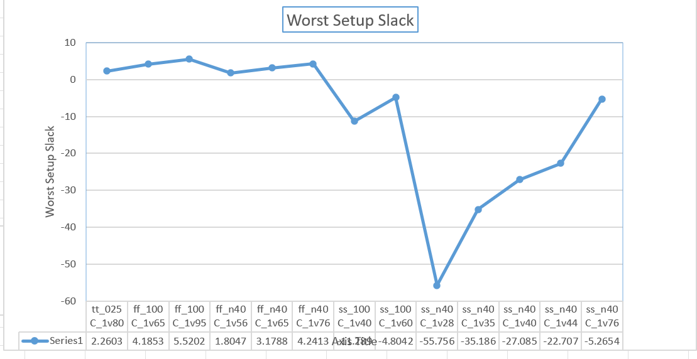</p>

<p align="center">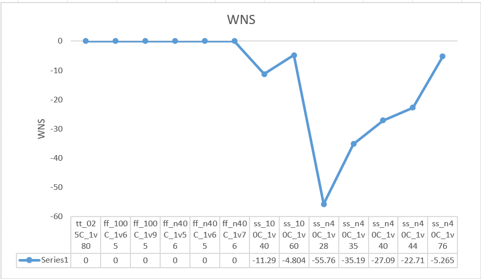</p>

<p align="center"></p>

### 📌 combined view

<p align="center">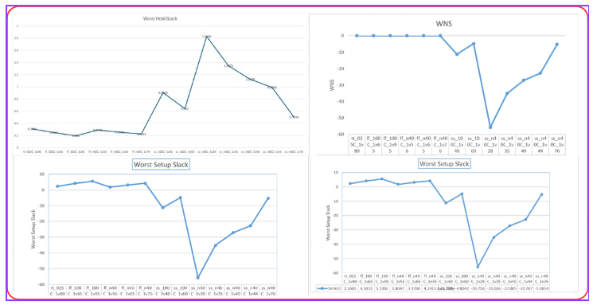</p>

</details>


